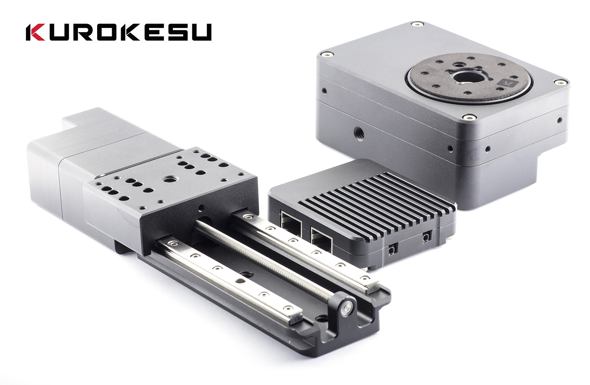
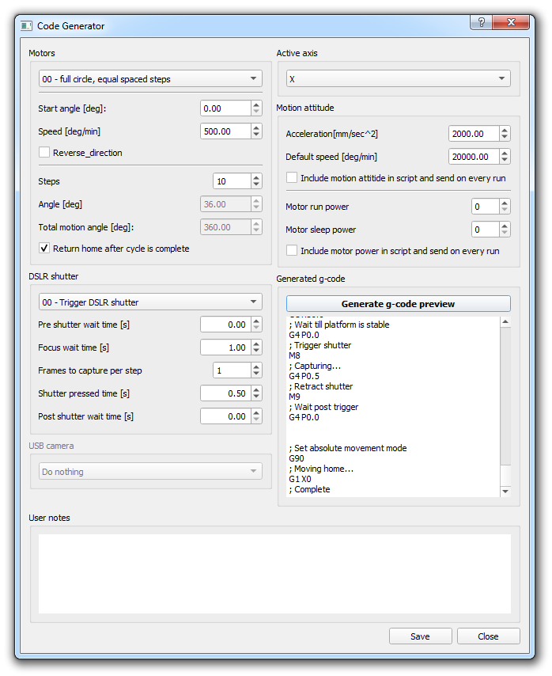

Advanced GUI software for motorized 360 product photography

Designed for motin control family:
* [Kurokesu motion systems](https://www.kurokesu.com/shop/motion_systems)
* [Motion controller documentation](https://wiki.kurokesu.com/shelves/motion-controllers)
* [Motion actoator documentation](https://wiki.kurokesu.com/shelves/motion-actuators)

Modular software concept allows g-code generation and to control motion controller and DSLR camera.

Motion platform allows fully automated 360° product capture and have fast production ready results.

